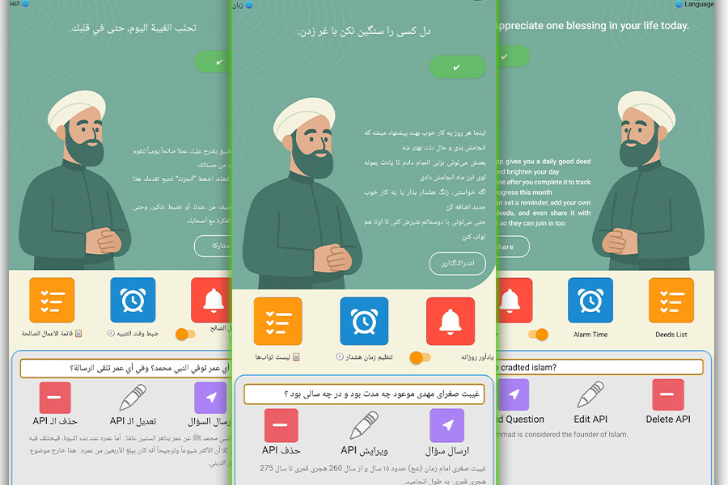

# TodayReward - 🌞 Your Daily Good Deed App
🙌 تطبيق ثواب اليوم - TodayReward - پیشنهاد ثواب روزانه
[🇬🇧 English](README.md) | [🇮🇷 فارسی](README_FA.md) | [🇸🇦 العربية](README_AR.md)

**A multilingual, motivational, and fully offline Android app that encourages doing one good deed per day. Built with Kotlin, Room, AlarmManager, and AI integration (Gemini API).**

> "Small acts of goodness, practiced daily, can transform the soul."

---

## 📱 App Preview



---

## 🎯 Project Purpose
This app was built using **Kotlin** under full **OOP and MVVM** principles as a practical exercise to consolidate essential Android development technologies.  
Despite being educational, it is fully functional and offers real daily use value.

The concept is simple yet uplifting: *“Do one good deed a day, track it, and feel better.”*

---

## ✅ Features

- **Daily Random Good Deed Suggestion**
  - Fetched randomly from local Room database
  - Caches the daily deed to avoid repetition

- **Custom Deeds**
  - Users can add their own good deeds
  - Stored in Room database

- **Mark as Done / Undo**
  - Toggle deeds done/not done status
  - Update stored record in database

- **Monthly Reset**
  - Allows resetting done states at the beginning of each month

- **Daily Reminder**
  - Custom time alarm using `AlarmManager + BroadcastReceiver + NotificationChannel`

- **Multilingual Support**
  - Fully RTL/LTR support
  - Persian 🇮🇷, English 🇺🇸, Arabic 🇸🇦
  - `strings.xml` translations for all

- **Ask Religious AI**
  - Ask religious/fiqh questions from Google Gemini AI
  - Secure API key entry + server validation

- **Modern UI**
  - Responsive layout using `LinearLayout`, `RelativeLayout`, `ScrollView`, `MaterialCardView`
  - DayNight theme enabled

---

## 🛠️ Technologies Used

| Category            | Tech / Library             | Complexity | Description |
|---------------------|----------------------------|------------|-------------|
| Programming         | Kotlin                     | Medium–High | Lambda, scope functions |
| Database            | Room (SQLite ORM)          | Medium     | CRUD for deeds |
| UI Design           | XML Layout + Material UI   | Medium     | Custom buttons, theme |
| Notifications       | AlarmManager + Receiver    | Medium     | Daily notifications |
| Network/API         | OkHttp + HttpURLConnection | Medium     | Send POST JSON to Gemini |
| Localization        | strings.xml + RTL/LTR      | Medium     | 3-language support |
| Preferences         | SharedPreferences          | Easy       | Save API key, time, lang |
| List Adapter        | RecyclerView + Adapter     | Medium     | Edit/delete deeds |
| Dialogs             | MaterialAlertDialog        | Easy–Medium| Confirm/reset/edit dialogs |

---

## 📂 App Structure

- **`MainActivity`**: Handles UI, notification, language, AI, and deed logic
- **`DeedListActivity`**: Full list of all deeds with edit/delete functionality
- **`DeedListAdapter`**: RecyclerView adapter with multilingual handling
- **`GoodDeedEntity` & `DeedDao`**: Room database model + queries
- **`NotificationReceiver`**: Triggers scheduled notifications
- **`askGeminiQuestion()`**: Async AI interaction with Gemini API
- **`res/` folder**: Themes, drawables, string translations

---

## 🤖 Why Build This?
The app was created purely as an **educational challenge** to practice:
- Room DB integration
- AlarmManager-based notifications
- RecyclerView and custom adapter logic
- Internationalization
- Real-time network calls to external AI API

Still, it proves **highly usable as a real utility**, especially for religious/moral motivation.

---

## 🌍 Multilingual README?

GitHub doesn’t support auto-switching README based on region. You can:

- Add links at the top of the main README like:

```markdown
[🇬🇧 English](README.md) | [🇮🇷 فارسی](README_FA.md) | [🇸🇦 العربية](README_AR.md)
```

- Place other versions in `README_FA.md`, `README_AR.md`, etc.
- Let users choose via these links.

---

## 📄 License

This project is open-source under the **MIT License** – feel free to learn, fork, and contribute.

---

✨ *Make one good deed today — for yourself, and for the world.*
