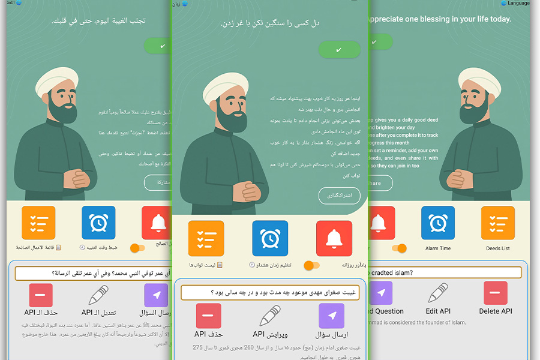

# 🙌 تطبيق ثواب اليوم - TodayReward

[🇬🇧 English](README.md) | [🇮🇷 فارسی](README_FA.md) | [🇸🇦 العربية](README_AR.md)

---

### 🎯 الهدف من المشروع:

تم تطوير هذا التطبيق باستخدام لغة Kotlin وهيكلية MVVM، وكان الهدف منه تجربة تقنيات أندرويد الحديثة. على الرغم من أن المشروع تجريبي، إلا أنه مفيد للاستعمال اليومي ويقدم تجربة استخدام إيجابية وفكرة بسيطة ولكن مؤثرة.

---

### ✅ الميزات الرئيسية:

- **عرض ثواب يومي عشوائي وتخزينه مؤقتًا**
- **إضافة ثوابات مخصصة مع دعم كامل لقواعد البيانات Room**
- **إعادة تعيين شهرية للحالة**
- **منبه يومي عبر Notification**
- **إرسال أسئلة شرعية إلى الذكاء الاصطناعي (Gemini)**
- **دعم ثلاث لغات (AR / EN / FA)**
- **تغيير الاتجاه واللغة حسب اللغة المختارة**
- **تخزين الإعدادات باستخدام SharedPreferences**

---

### 🛠️ التقنيات والأدوات المستخدمة:

| الفئة | التقنية | المستوى | الوصف |
|------|---------|----------|-------|
| اللغة | Kotlin | متوسط | استخدام الدوال، Lambda، OOP |
| قواعد البيانات | Room ORM | متوسط | CRUD للثوابات |
| الإشعارات | AlarmManager + BroadcastReceiver | متوسط | منبه يومي مخصص |
| API | HttpURLConnection + OkHttp | متوسط | الاتصال بـ Gemini API |
| الواجهة | XML + Material Design | بسيط | تصميم حديث ومتجاوب |
| الترجمة | Strings.xml | متوسط | دعم كامل لـ ٣ لغات |

---

### 📱 لقطة شاشة

📌 الصورة التالية توضح التطبيق بثلاث لغات:

---

### 📊 بنية المشروع:

- `MainActivity`: عرض الثواب اليومي والتفاعل مع API
- `DeedListActivity`: قائمة الثوابات
- `GoodDeedEntity`, `DeedDao`: إدارة البيانات
- `NotificationReceiver`: إرسال الإشعارات اليومية
- `res/values`: الترجمات والألوان والأنماط

---

**⚠️ ملاحظة:** هذا المشروع تم إنشاؤه لأغراض تعليمية وتجريبية. ومع ذلك، يمكن استخدامه يوميًا بشكل عملي.