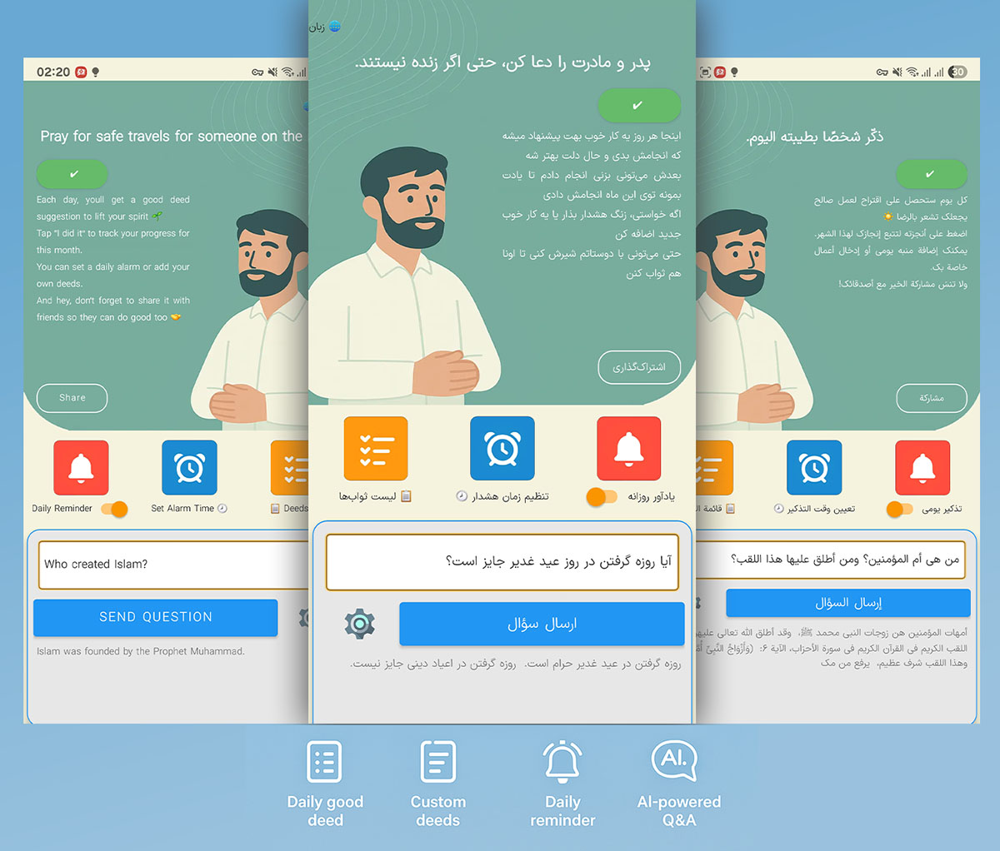

# 🙌 اپلیکیشن ثواب روزانه - TodayReward

[🇬🇧 English](README.md) | [🇮🇷 فارسی](README_FA.md) | [🇸🇦 العربية](README_AR.md)

---

### 🎯 هدف کلی پروژه:

این اپلیکیشن با زبان برنامه‌نویسی Kotlin و معماری MVVM ساخته شده و هدف آن تمرین فناوری‌های روز توسعه اندروید است. با وجود هدف تمرینی، این برنامه کاملاً قابل استفاده روزمره نیز هست و با ایده‌ای ساده و انسانی، تجربه‌ای مثبت فراهم می‌کند.

---

### ✅ عملکرد اصلی:

- **نمایش تصادفی ثواب روزانه با کش شدن روزانه**
- **افزودن ثواب دلخواه با پشتیبانی کامل از دیتابیس Room**
- **ریست ماهانه وضعیت‌ها**
- **امکان تنظیم یادآور روزانه با Notification**
- **ارسال پرسش شرعی به هوش مصنوعی Gemini**
- **پشتیبانی از سه زبان (FA / EN / AR)**
- **تغییر پویا جهت و محتوای برنامه بر اساس زبان**
- **ذخیره‌سازی اطلاعات در SharedPreferences**

---

### 🛠️ تکنولوژی‌ها و ابزارها:

| دسته‌بندی | فناوری / ابزار | پیچیدگی | توضیح |
|-----------|----------------|----------|--------|
| زبان | Kotlin | متوسط | استفاده از اسکوپ‌ فانکشن، لامبدا، OOP |
| پایگاه داده | Room ORM | متوسط | مدیریت CRUD ثواب‌ها |
| اعلان | AlarmManager + BroadcastReceiver | متوسط | نوتیفیکیشن روزانه |
| API | HttpURLConnection + OkHttp | متوسط | ارتباط با مدل هوش مصنوعی |
| UI | XML + Material Design | ساده | طراحی واکنش‌گرا و مدرن |
| زبان | Strings.xml | متوسط | ترجمه کامل برای ۳ زبان |

---

### 📱 اسکرین‌شات

📌 تصویر زیر نحوه نمایش برنامه در سه زبان را نشان می‌دهد:

---

### 📊 ساختار پروژه:

- `MainActivity`: مدیریت اصلی نمایش ثواب روز و API
- `DeedListActivity`: لیست ثواب‌های ثبت‌شده
- `GoodDeedEntity`, `DeedDao`: مدیریت دیتابیس
- `NotificationReceiver`: یادآوری روزانه
- `res/values`: ترجمه‌ها، رنگ‌ها، استایل‌ها

---

**⚠️ توجه:** این پروژه برای یادگیری و تمرین ساخته شده و هدف تجاری ندارد. با این حال، برای استفاده شخصی کاملاً کاربردی است.
